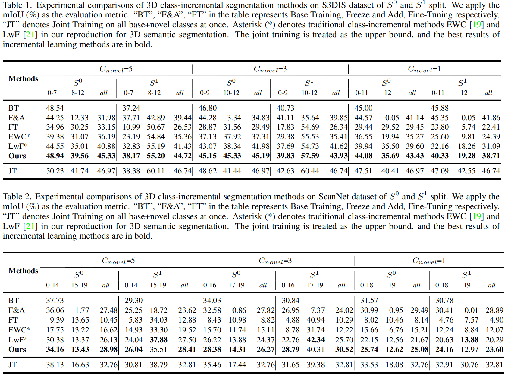

# Geometry and Uncertainty-Aware 3D Point Cloud Class-Incremental Semantic Segmentation
This is the code repository related to "[Geometry and Uncertainty-Aware 3D Point Cloud Class-Incremental Semantic Segmentation](https://openaccess.thecvf.com/content/CVPR2023/html/Yang_Geometry_and_Uncertainty-Aware_3D_Point_Cloud_Class-Incremental_Semantic_Segmentation_CVPR_2023_paper.html)" (CVPR 2023, Poster) in PyTorch implementation.


## 1. Abstract
Despite the significant recent progress made on 3D point cloud semantic segmentation, the current methods require training data for all classes at once, and are not suitable for real-life scenarios where new categories are being continuously discovered. Substantial memory storage and expensive re-training is required to update the model to sequentially arriving data for new concepts. In this paper, to continually learn new categories using previous knowledge, we introduce class-incremental semantic segmentation of 3D point cloud. Unlike 2D images, 3D point clouds are disordered and unstructured, making it difficult to store and transfer knowledge especially when the previous data is not available. We further face the challenge of semantic shift, where previous/future classes are indiscriminately collapsed and treated as the background in the current step, causing a dramatic performance drop on past classes. We exploit the structure of point cloud and propose two strategies to address these challenges. First, we design a geometry-aware distillation module that transfers point-wise feature associations in terms of their geometric characteristics. To counter forgetting caused by the semantic shift, we further develop an uncertainty-aware pseudo-labelling scheme that eliminates noise in uncertain pseudo-labels by label propagation within a local neighborhood. Our extensive experiments on S3DIS and ScanNet in a class-incremental setting show impressive results comparable to the joint training strategy (upper bound). 


## 2. Setup
This code is tested with Python 3.7, Pytorch 1.7.0 and CUDA 11.0, you can follow these steps:
```
   conda create -n 3DPC-CISS python=3.7
   conda activate 3DPC-CISS
   pip install torch==1.7.0+cu110 torchvision==0.8.1+cu110 torchaudio==0.7.0 -f https://download.pytorch.org/whl/torch_stable.html
   pip install tensorboard transforms3d h5py torch-cluster==1.5.9 scikit-learn 
```

## 3. Usage
### Data preparation
#### For S3DIS Dataset:
1.  Download [S3DIS Dataset Aligned Version 1.2](http://buildingparser.stanford.edu/dataset.html)，decompress and put the download files in the ./datasets/S3DIS/.
2.  Process the raw data into `.npy` format files by running:
   ```
   cd ./preprocess
   python collect_s3dis_data.py --data_path '../datasets/S3DIS/Stanford3dDataset_v1.2_Aligned_Version'
   ```
   The  folder named `scenes` will be generated in `../datasets/S3DIS/` by default.

3. Split the rooms into blocks by running:
    ```python room2blocks.py --data_path ../datasets/S3DIS/scenes```
   The folder named  ` blocks_bs1_s1` will be generated in `../datasets/S3DIS/` by default.

#### For ScanNet Dataset:
1. Download [ScanNet V2](http://www.scan-net.org/), put the download files (folder `scans` ) in the ./datasets/ScanNet/.
2.  Process the raw data into `.npy` format files by running:
    ```
    cd ./preprocess
    python collect_scannet_data.py --data_path '../datasets/ScanNet/scans'
    ```
    The folder named `scenes` will be generated in `../datasets/ScanNet/` by default.
3. Split the rooms into blocks by running:
    ```python room2blocks.py --data_path '../datasets/ScanNet/scenes'```
    The folder named `blocks_bs1_s1` will be generated in `../datasets/ScanNet/` by default.

### Training
    If you want to train the baselines (i.e., joint training, freeze-and-add, finetuning, EWC and LwF methods) and our method of different settings, run:
     ```bash ./scripts/bash_train_tasks.sh```
     See file `./scripts/bash_train_tasks.sh` for details, you can modify the corresponding training scripts for your customized settings and hyperparameters.

### Evaluation
    After training, you can run the following script for evaluation:
    ```bash ./scripts/bash_eval_tasks.sh```
     See file `./scripts/bash_eval_tasks.sh` for details, you can modify the corresponding scripts for different requirements.

## 4. Results
Results on two datasets of various settings are showing as follows:
<p align='center'>
  
</p>

## 5. Citation
If it is helpful to your research, please cite our paper as follows:

    @inproceedings{yang2023geometry,
      title={Geometry and Uncertainty-Aware 3D Point Cloud Class-Incremental Semantic Segmentation},
      author={Yang, Yuwei and Hayat, Munawar and Jin, Zhao and Ren, Chao and Lei, Yinjie},
      booktitle={Proceedings of the IEEE/CVF Conference on Computer Vision and Pattern Recognition},
      pages={21759--21768},
      year={2023}
    }

## 6. Acknowledgement
We would like to thank [DGCNN](https://github.com/WangYueFt/dgcnn/tree/master/pytorch) for point cloud feature extraction backbone codebase and [NSA-MC dropout](https://github.com/chaoqi7/Uncertainty_Estimation_PCSS) for uncertainty estimation codebase. 

## 7. License
This repository is released under MIT License (See LICENSE file for details).
